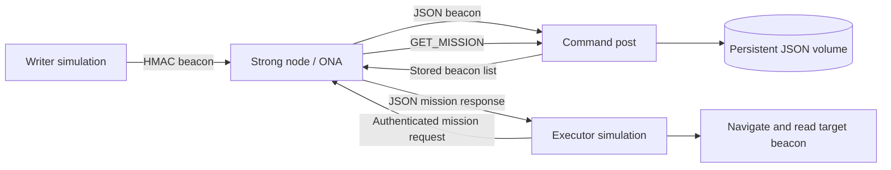

# Current system architecture

The workspace contains two independent Python repositories connected by a shared
Docker deployment. All imports are standard library or local modules. There is
no SQL database, cache, message broker, background worker, scheduled job, external
API, frontend, ML model or GPU dependency.

## Actual processing flow

Writer movement applies spatial/temporal drop rules. The current CLI demonstration
moves from (0, 0) toward (15, 0), drops one VICTIM beacon at (10.5, 0), and simulates
radio range/loss. It encodes the beacon and authenticates it with HMAC.

Strong node verifies the message, PoD range, event code, timestamp freshness and
replay status. It converts local coordinates into GPS and forwards a JSON record
to the command post. It acknowledges the writer only after receiving `STORED`.
Failed forwarding does not consume the replay key, allowing a retry.

Command post keeps the mission list in memory and writes it atomically to JSON.
It loads existing records on startup. Corrupt storage prevents startup instead of
silently resetting data. `GET_MISSION` returns the complete stored list.

Executor authenticates a mission request through the strong node, reconstructs
WeakNode objects, picks the nearest beacon, simulates movement and reads nearby
nodes. PoD decays with elapsed time. Completion is printed with target ID,
coordinates and readings. Reading a beacon does not remove or mark it completed
in command-post storage.

## Current module responsibilities

| Location | Module | Responsibility |
| --- | --- | --- |
| Network | strong_node_server.py | Authenticated TCP handling, validation, replay checks, GPS enrichment and relay |
| Network | command_post_server.py | TCP JSON storage endpoint, load/save and mission retrieval |
| Network | healthcheck.py | Read-only mission requests for Docker health |
| Both | beacon_codec.py | Encode/decode the 16-byte binary payload |
| Both | security_config.py | Message constants and environment-backed HMAC key/helpers |
| Both | frame_translation.py | Local-coordinate to GPS conversion; used by network relay |
| Robots-Network | writer.py | Movement, drop rules and writer attrition simulation |
| Robots-Network | weak_node.py | Beacon object, reconstruction and PoD decay |
| Robots-Network | executor.py | Nearest-target choice, navigation and beacon readings |
| Robots-Network | network_physics.py | Simulated distance and radio packet loss |
| Robots-Network | network_client.py | Environment-configured authenticated TCP transport |
| Robots-Network | writer_client.py | Writer CLI workflow and acknowledgement checking |
| Robots-Network | executor_client.py | Executor CLI workflow and completion result |
| Robots-Network | strong_node_server.py | Unused legacy JSON-only relay; incompatible with current binary clients |

## Deployment boundaries

Two network processes run continuously. Writer and executor run as separate
finite containers under the `mission` profile. Compose gates executor startup on
successful writer completion. This ordering is local orchestration, not a
business-level mission dispatcher.

The command post uses the `aess-network_beacons` volume mounted at `/data`.
Only the strong-node port is published, to localhost by default. Tests use their
own unique Compose project, network, volume and ephemeral host port.

## Current mission semantics and future functionality

A mission is presently the full beacon list. There is no independent Mission
record, assignment, prioritization, analysis result, task action or completion
acknowledgement. Executor polls the network rather than receiving an NGO push.
The nearest target can be old, including at the same coordinates as a new beacon.

Future NGO dispatch and analysis should be explicit application services/functions
with a defined protocol and mission state. Add containers only once their code
requires separate processes. See [code-structure.md](code-structure.md) for the
incremental proposal and [security.md](security.md) for present limitations.
